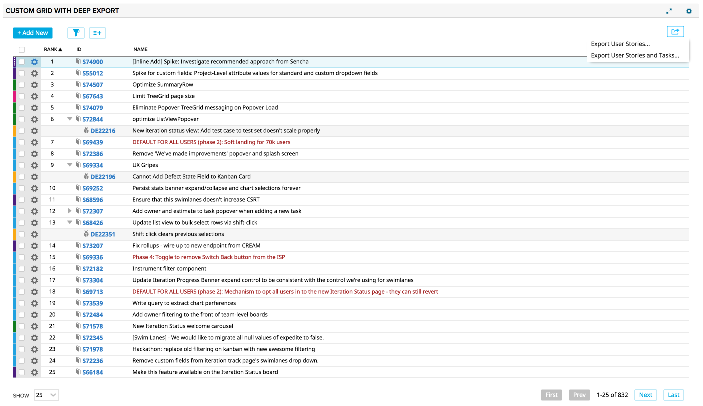

# Custom Grid with deep export

Note that as with other custom lists, the filter is only applied at the root level.

Additionally, items can be filtered by an ancestor portfolio item. (e.g. filter Features that are ultimately children of the higher level Theme).
If placed on a page that also has a [pi-ancestor-filter-broadcaster](https://github.com/RallyTechServices/pi-ancestor-filter-broadcaster),
and filter by ancestor portfolio item is enabled, it will listen to the broadcaster for the selected ancestor or project scope.

Several export options are provided and change depending on the root record type
chosen in Edit App Settings...

When a portfolio item is selected as the root type:

    * **Export Portfolio Items...** Exports only portfolio items in the portfolio item tree that have been displayed due to the filter at the root level item. Portfolio items of every available level from the root level down are exported.

    * **Export Portfolio Items and User Stories...** Only portfolio items and stories in the tree will be exported.

    * **Export Portfolio Items, User Stories and Tasks...** These item types will be exported.

    * **Export Portfolio Items and Child Items...** Portfolio items, stories, tasks, defects, and test cases will be exported.  Test cases that are children of defects (that are children of stories) will be exported, as will defects that are children of test cases that are children of stories.  If a defect is a child of a story and is also a child of a test case that is displayed, the defect may not appear where you expect.

When user story is selected as the root type:

    * **Export User Stories...** Only stories in the tree will be exported.

    * **Export User Stories and Tasks...** These item types will be exported.

    * **Export User Stories and Child Items...** Stories, tasks, defects, and test cases will be exported.  Test cases that are children of defects (that are children of stories) will be exported, as will defects that are children of test cases that are children of stories.  If a defect is a child of a story and is also a child of a test case that is displayed, the defect may not appear where you expect.

If this app is on a Timebox Scoped page, then the appropriate timebox filter
will be applied if the Timebox is valid for the queried model.  If the Timebox
is not valid for the selected model, then the Timebox scope will be ignored.

Optionally, project scope can be ignored.

### Caveats
* If an item has a parent that is out of scope, then that item's relationship will not be seen.

* When a portfolio item is chosen as the root level type, the output will contain a column for each portfolio item record type.  For lower level items, these columns will be populated with the FormattedID of the ancestor portfolio item that it is associated with.  

* The output will contain a column called User Story that represents the top level user story that the item has as an ancestor.  If the story hierarchy has multiple levels, the lower level items will continue to put the top level user story ID into this field.  Use the fields of the lower level record types to display the closer related record.  For example, if a task is on a grandchild story, the grandparent story will show in the User Story column.  To show the story the task belongs to directly, choose the WorkProduct field to export.

* For portfolio items and stories, it is possible that the associated ancestor column (e.g., User Story) will have the current record's ID if that record is the appropriate level.  

## Development Notes

### First Load

If you've just downloaded this from github and you want to do development,
you're going to need to have these installed:

 * node.js
 * grunt-cli
 * grunt-init

Since you're getting this from github, we assume you have the command line
version of git also installed.  If not, go get git.

If you have those three installed, just type this in the root directory here
to get set up to develop:

  npm install

### Structure

  * src/javascript:  All the JS files saved here will be compiled into the
  target html file
  * src/style: All of the stylesheets saved here will be compiled into the
  target html file
  * test/fast: Fast jasmine tests go here.  There should also be a helper
  file that is loaded first for creating mocks and doing other shortcuts
  (fastHelper.js) **Tests should be in a file named <something>-spec.js**
  * test/slow: Slow jasmine tests go here.  There should also be a helper
  file that is loaded first for creating mocks and doing other shortcuts
  (slowHelper.js) **Tests should be in a file named <something>-spec.js**
  * templates: This is where templates that are used to create the production
  and debug html files live.  The advantage of using these templates is that
  you can configure the behavior of the html around the JS.
  * config.json: This file contains the configuration settings necessary to
  create the debug and production html files.  Server is only used for debug,
  name, className and sdk are used for both.
  * package.json: This file lists the dependencies for grunt
  * auth.json: This file should NOT be checked in.  Create this to run the
  slow test specs.  It should look like:
    {
        "username":"you@company.com",
        "password":"secret"
    }

### Usage of the grunt file
####Tasks

##### grunt debug

Use grunt debug to create the debug html file.  You only need to run this when you have added new files to
the src directories.

##### grunt build

Use grunt build to create the production html file.  We still have to copy the html file to a panel to test.

##### grunt test-fast

Use grunt test-fast to run the Jasmine tests in the fast directory.  Typically, the tests in the fast
directory are more pure unit tests and do not need to connect to Rally.

##### grunt test-slow

Use grunt test-slow to run the Jasmine tests in the slow directory.  Typically, the tests in the slow
directory are more like integration tests in that they require connecting to Rally and interacting with
data.

##### grunt deploy

Use grunt deploy to build the deploy file and then install it into a new page/app in Rally.  It will create the page on the Home tab and then add a custom html app to the page.  The page will be named using the "name" key in the config.json file (with an asterisk prepended).

You can use the makeauth task to create this file OR construct it by hand.  Caution: the
makeauth task will delete this file.

The auth.json file must contain the following keys:
{
    "username": "fred@fred.com",
    "password": "fredfredfred",
    "server": "https://us1.rallydev.com"
}

(Use your username and password, of course.)  NOTE: not sure why yet, but this task does not work against the demo environments.  Also, .gitignore is configured so that this file does not get committed.  Do not commit this file with a password in it!

When the first install is complete, the script will add the ObjectIDs of the page and panel to the auth.json file, so that it looks like this:

{
    "username": "fred@fred.com",
    "password": "fredfredfred",
    "server": "https://us1.rallydev.com",
    "pageOid": "5233218186",
    "panelOid": 5233218188
}

On subsequent installs, the script will write to this same page/app. Remove the
pageOid and panelOid lines to install in a new place.  CAUTION:  Currently, error checking is not enabled, so it will fail silently.

##### grunt watch

Run this to watch files (js and css).  When a file is saved, the task will automatically build, run fast tests, and deploy as shown in the deploy section above.

##### grunt makeauth

This task will create an auth.json file in the proper format for you.  **Be careful** this will delete any existing auth.json file.  See **grunt deploy** to see the contents and use of this file.

##### grunt --help  

Get a full listing of available targets.
